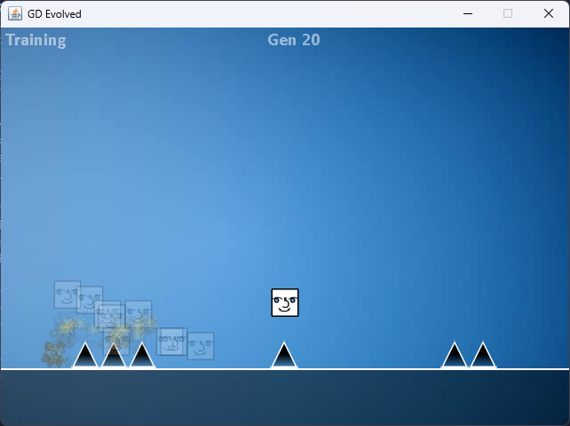

# Geometry Dash AI
Author: Hans Wang 
Date: 2023-11-09 

## Description
**_Training AI to play Geometry Dash._**  
This project uses genetic algorithms to train neural networks to learn to play Geometry Dash.

## Overview
This project is a clone of the game "Geometry Dash", along with AI capabilities.  
In the game's main menu, press T to cycle between Player, Training, and AI modes. While in Training mode, enter a level, and 50 instances of AI are simultaneously trained to play the game generation by generation.  
In each generation, the fittest individuals, the ones that make it the furthest in the level, are selected to produce children and carry on desirable traits. In this case, these desirable traits constitute "skill" in playing the game. This is known as a genetic algorithm and it is how the AI (represented by a multilayer perceptron neural network) learns to play the game.  
During training, < and > keys can control the speed of the training, with the max speedup being 100x. Once an AI completes a level, the training is successful and terminates. You may now exit to the main menu and go to AI mode, where the AI that finished training will be selected to play the game.

___

GeometryDashAI is built on top of:
- [Polygonal Run](https://github.com/hanswang0608/Polygonal-Run): My Geometry Dash clone game.
- [JavaNN](https://github.com/hanswang0608/JavaNN): My java ML library for the neural network and genetic algorithm.
